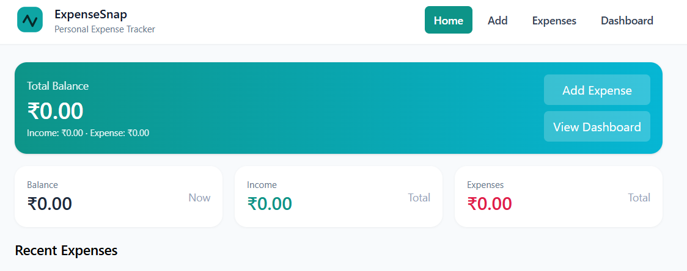
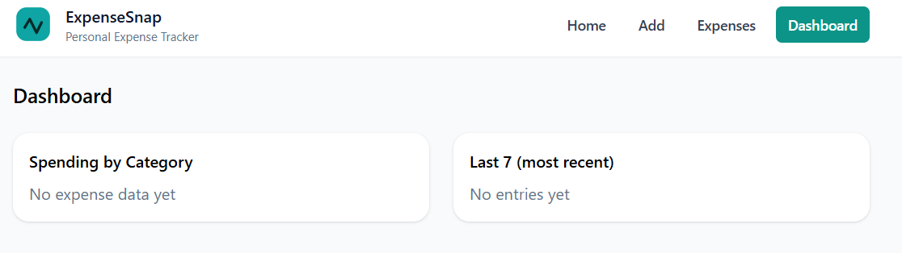
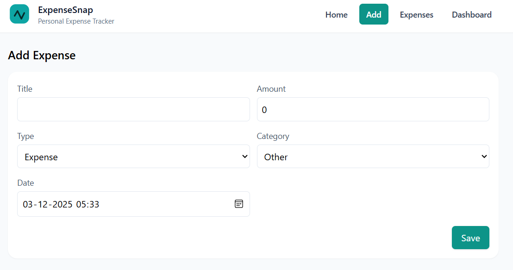

## 📘 ExpenseSnap — Personal Expense Tracker (React + TypeScript + Vite)

A modern, elegant, and lightning-fast personal expense tracker built with:

⚛️ React 18 + TypeScript

⚡ Vite

🎨 Tailwind CSS

📊 Recharts Dashboard

🧠 Context API (no Redux)

💾 LocalStorage persistence

📱 Fully responsive UI

--- 
Track your expenses. Visualize your spending. Stay in control.
ExpenseSnap is designed to feel like a polished, real-world finance app.
---

## 🔥 Features

#### ✅ Add / Edit / Delete Expenses

- Add title, amount, category, date, and income/expense type

- Edit any existing entry

- Delete instantly

---

#### ✅ LocalStorage Data Persistence

Your data stays intact even after refresh — no backend required.

---

#### ✅ Beautiful Dashboard

Visual insights powered by Recharts:

- 🥧 Pie Chart — Spending by category

- 📊 Bar Chart — Last 7 transactions

---
## ✅ Home Summary

Live balance

Total income & total expense

Recent transactions preview

## ✅ All Expenses Page

Full list of expenses

Quick edit/delete actions

## ✅ Responsive Modern UI

Built with Tailwind CSS

Works flawlessly on mobile, tablet & desktop

## 🚀 Tech Stack
## 🚀 Tech Stack

| Technology      | Purpose                  |
|-----------------|--------------------------|
| ⚛️ React 18     | Frontend UI              |
| 🟦 TypeScript   | Type-safety              |
| ⚡ Vite         | Super-fast bundling      |
| 🎨 Tailwind CSS | UI styling               |
| 📊 Recharts     | Dashboard charts         |
| 🧠 Context API  | Global state management  |
| 💾 LocalStorage | Persistence              |


## 📂 Project Structure
```
expense-snap-ts/
├─ index.html
├─ package.json
├─ tsconfig.json
├─ vite.config.ts
├─ tailwind.config.cjs
├─ postcss.config.cjs
├─ src/
│  ├─ main.tsx
│  ├─ App.tsx
│  ├─ index.css
│  ├─ assets/logo.svg
│  ├─ types/Expense.ts
│  ├─ utils/localStorage.ts
│  ├─ context/ExpenseContext.tsx
│  ├─ components/
│  │  ├─ Nav.tsx
│  │  ├─ Card.tsx
│  │  ├─ ExpenseForm.tsx
│  │  ├─ ExpenseList.tsx
│  │  └─ ExpenseItem.tsx
│  ├─ pages/
│  │  ├─ Home.tsx
│  │  ├─ AddExpense.tsx
│  │  ├─ AllExpenses.tsx
│  │  └─ Dashboard.tsx
│  └─ __tests__/App.test.tsx
```
## 🛠️ Installation & Setup
#### 1️⃣ Create a Vite + React + TS project

`npm create vite@latest expense-snap-ts -- --template react-ts`
`cd expense-snap-ts`

#### 2️⃣ Install Tailwind CSS
`npm install -D tailwindcss postcss autoprefixer`
`npx tailwindcss init -p`

#### 3️⃣ Install dependencies
`npm install react-router-dom`
`npm install recharts`
`npm install uuid`
`npm install -D @types/uuid`

#### 4️⃣ Install testing tools (optional)
`npm install -D vitest jsdom @testing-library/react` `@testing-library/jest-dom`


#### ▶️ Run the Project
`npm run dev`

---
Open your browser at:

http://localhost:5173

#### 🧪 Running Tests
`npm test`

## 📸 Screenshots 

🏠 Home Page



➕ Add Expense



📊 Dashboard



---
## 💡 Tech Highlights

### 🔥 Vite

- Ultra-fast development environment with instant refresh.

### 🧠 Context API

- Simple and scalable state management — no Redux needed.

### 🎨 Tailwind CSS

- Utility-first styling for a clean, modern UI.

### 📊 Recharts

- Beautiful analytics visualizations.

### 💾 LocalStorage

- Persistent data without a backend.

## 📝 Future Enhancements

- Dark mode

- Export to CSV / PDF

- Budget limits and alerts

- Recurring expenses

- Authentication + backend

- Weekly/monthly analytics


## ❤️ Author

Umesh Raju
React • TypeScript • Full Stack Developer

If you like this project, ⭐ star the repo!
### 📜 License

This project is licensed under the MIT License — free to use, modify, and distribute.
